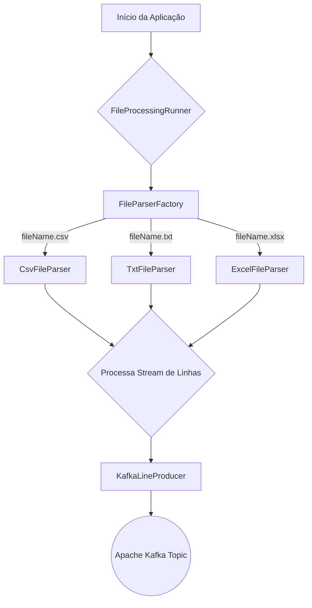

# File Processor com Spring, Kotlin e Kafka


## 📖 Visão Geral

Este é um projeto que criei em **Kotlin** e **Spring Boot** para praticar. A ideia é simples: o programa lê um arquivo (pode ser `.txt`, `.csv` ou `.xlsx`), pega cada linha e envia como uma mensagem para o **Apache Kafka**.

O mais importante aqui não é o que o programa *faz*, mas *como* ele foi construído. Meu objetivo foi focar em escrever um código limpo e bem organizado, aplicando conceitos como **SOLID** e alguns padrões de projeto.

Um dos desafios legais foi pensar em como o programa se comportaria com arquivos gigantes. Para resolver isso, ele foi feito para ler os arquivos aos poucos (*streaming*), sem nunca carregar tudo de uma vez na memória. Assim, ele consegue processar arquivos de qualquer tamanho sem consumir tanta memória.

## ✨ Principais Características

- **Suporte a Múltiplos Formatos**: Processa arquivos de texto (`.txt`), CSV (`.csv`) e Excel (`.xls`, `.xlsx`) de forma transparente.
- **Processamento Eficiente de Arquivos Grandes**: Utiliza abordagens de *streaming* (lazy loading) para ler os arquivos linha por linha, garantindo um baixo e constante consumo de memória, independentemente do tamanho do arquivo.
- **Arquitetura Orientada a Princípios**:
    - **SOLID**: Aderência aos cinco princípios, especialmente o **Princípio Aberto/Fechado (Open/Closed Principle)**, que permite adicionar suporte a novos tipos de arquivo (ex: XML, JSON) sem modificar o código existente.
    - **Clean Code**: Foco em código legível, conciso e bem documentado.
- **Integração com Kafka**: Desacopla o processamento das linhas, enviando cada uma como uma mensagem para um tópico Kafka, permitindo que sistemas consumidores processem esses dados de forma assíncrona.
- **Design Patterns**:
    - **Strategy Pattern**: Utiliza uma interface `FileParser` com múltiplas implementações (`TxtFileParser`, `CsvFileParser`, etc.), permitindo que o algoritmo de parsing seja selecionado dinamicamente em tempo de execução.
    - **Factory Pattern**: Uma classe `FileParserFactory` centraliza a lógica de decisão para escolher o *parser* correto com base na extensão do arquivo.

## 🏛️ Arquitetura

O coração do sistema é o **Strategy Pattern**. A interface `FileParser` define um contrato único para a operação de parsing, enquanto cada classe concreta implementa a lógica específica para um tipo de arquivo.

O fluxo de execução é o seguinte:

1.  A aplicação é iniciada via `CommandLineRunner`, recebendo o caminho de um arquivo como argumento.
2.  O `FileProcessingRunner` solicita à `FileParserFactory` o parser adequado para o arquivo.
3.  A `FileParserFactory` inspeciona a extensão do arquivo e retorna a implementação correta do `FileParser` (ex: `CsvFileParser`).
4.  O parser selecionado lê o arquivo linha por linha, retornando um `Stream<String>` (lazy). Isso garante que o arquivo nunca seja totalmente carregado em memória.
5.  Cada linha do stream é passada para o `KafkaLineProducer`, que a envia como uma mensagem para o tópico Kafka configurado.



## 🛠️ Tecnologias Utilizadas

- **Linguagem**: [Kotlin](https://kotlinlang.org/)
- **Framework**: [Spring Boot](https://spring.io/projects/spring-boot)
- **Mensageria**: [Spring for Apache Kafka](https://spring.io/projects/spring-kafka)
- **Build Tool**: [Gradle](https://gradle.org/) (com Kotlin DSL)
- **Bibliotecas de Parsing**:
    - [OpenCSV](http://opencsv.sourceforge.net/) (para arquivos `.csv`)
    - [Apache POI](https://poi.apache.org/) (para arquivos `.xls` e `.xlsx`)

## 🚀 Como Executar o Projeto

### Pré-requisitos

- **JDK 21** ou superior.
- **Docker** e **Docker Compose** (recomendado para rodar o Kafka).
- Uma instância do **Apache Kafka** rodando.

### 1. Iniciar o Kafka

A maneira mais simples de iniciar o Kafka e o Zookeeper é usando Docker Compose. Crie um arquivo `docker-compose.yml` na raiz do projeto:

```yaml
version: '3'
services:
  zookeeper:
    image: confluentinc/cp-zookeeper:latest
    environment:
      ZOOKEEPER_CLIENT_PORT: 2181
      ZOOKEEPER_TICK_TIME: 2000
    ports:
      - "2181:2181"

  kafka:
    image: confluentinc/cp-kafka:latest
    depends_on:
      - zookeeper
    ports:
      - "9092:9092"
    environment:
      KAFKA_BROKER_ID: 1
      KAFKA_ZOOKEEPER_CONNECT: zookeeper:2181
      KAFKA_ADVERTISED_LISTENERS: PLAINTEXT://localhost:9092
      KAFKA_OFFSETS_TOPIC_REPLICATION_FACTOR: 1
```

Inicie os contêineres:
```bash
docker-compose up -d
```

### 2. Criar o Tópico no Kafka
Crie o tópico `file-lines-topic` que a aplicação usará:

```bash
docker-compose exec kafka kafka-topics --create \
--topic file-lines-topic \
--bootstrap-server localhost:9092 \
--partitions 1 \
--replication-factor 1
```

### 3. Configurar a Aplicação
O arquivo `src/main/resources/application.properties` já está configurado para se conectar ao Kafka em `localhost:9092`.

```properties
spring.kafka.bootstrap-servers=localhost:9092
kafka.topic.name=file-lines-topic
spring.kafka.producer.key-serializer=org.apache.kafka.common.serialization.StringSerializer
spring.kafka.producer.value-serializer=org.apache.kafka.common.serialization.StringSerializer
```

### 4. Executar
Compile e execute a aplicação usando o Gradle Wrapper, passando o caminho absoluto para o arquivo que deseja processar como argumento.

**Exemplos:**
```bash
# Para Linux/macOS
./gradlew bootRun --args="/caminho/completo/para/seu/arquivo.csv"

# Para Windows
gradlew.bat bootRun --args="C:\caminho\completo\para\seu\arquivo.xlsx"
```
Você verá os logs da aplicação indicando o parser utilizado e as mensagens sendo enviadas para o Kafka.

## 🔮 Melhorias Futuras

- **Consumidor Kafka**: Criar um microserviço separado que consome as linhas do tópico Kafka para realizar o processamento de fato.
- **Envio Assíncrono e em Lote**: Modificar o `KafkaProducer` para enviar mensagens de forma assíncrona e em lotes, aumentando significativamente a performance.
- **Dead-Letter Queue (DLQ)**: Implementar uma estratégia para lidar com linhas malformadas, enviando-as para um tópico de "cartas mortas" para análise posterior, em vez de interromper o processamento.
- **API REST para Upload**: Em vez de um `CommandLineRunner`, expor um endpoint REST para que os usuários possam fazer o upload dos arquivos via HTTP.
- **Testes Unitários e de Integração**: Adicionar uma suíte de testes robusta para validar o comportamento dos parsers e a integração com o Kafka.